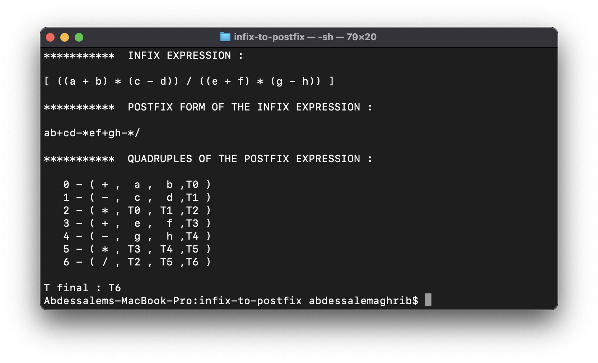

# Infix To Postfix Expression

## Description

\
The [Postfix notation](https://en.wikipedia.org/wiki/Reverse_Polish_notation) is used to represent [algebraic expressions](https://en.wikipedia.org/wiki/Algebraic_expression). The expressions written in Postfix form are evaluated faster compared to [Infix notation](https://en.wikipedia.org/wiki/Infix_notation) as parenthesis are not required in postfix.

This project offers the possibility to convert an [Infix expression](https://en.wikipedia.org/wiki/Infix_notation) into a [Postfix expression](https://en.wikipedia.org/wiki/Reverse_Polish_notation) using [C programming language](https://en.wikipedia.org/wiki/C_(programming_language)).

The implementation of this project is based on the [Stack archetecture](https://en.wikipedia.org/wiki/Stack_(abstract_data_type)) to represent nodes. While, each node contains 2 fields :

- Symbol : +, -, *, /, (, )
- Address to the next node.

\
<spcace>

## Tools used

\
<spcace>

| Tool | Version |
| ----------- | ----------- |
| Machine | MacBook Pro 2,3 GHz Dual-Core Intel Core i5 - 8 GB 2133 MHz LPDDR3 |
| Operating system | macOS Big Sur 11.5.2 |
| GCC | version [11.1.0](https://gcc.gnu.org/gcc-11/) |

\
<spcace>

## Execution

\
<spcace>

- We take as an example the following Infix expression :

> ((a + b) * (c - d)) / ((e + f) * (g - h))

- The Postfix form of the last Infix expression :

> ab+cd-*ef+gh-*/

- To compile code :

```sh
cd <project_path>
gcc main.c -o main
```

- To execute code :

```sh
./main
```

- Results :

